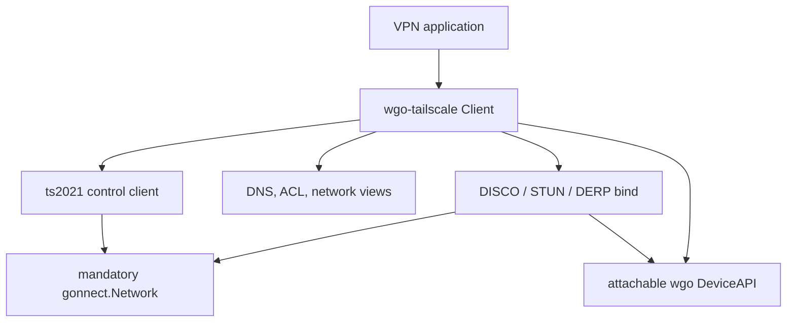
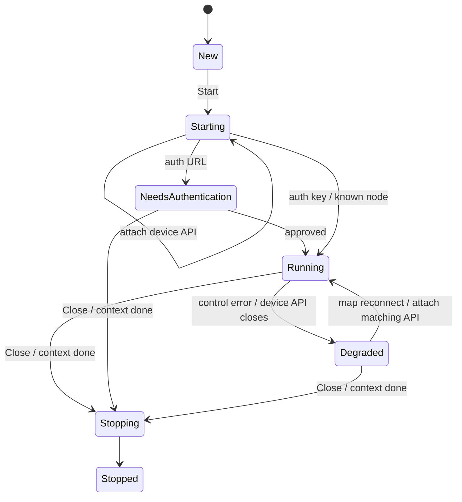

# Architecture

## Design boundary

The host application is the resource owner. `wgo-tailscale.Client` is one
controller attached to that host:

| Resource | Owner | Library behavior |
|---|---|---|
| `device.DeviceAPI` and lifecycle | Host | Can attach it before or after `Start`; never calls `Up`, `Down`, or `Close` |
| TUN | Host | Never creates, configures, or reads it directly |
| WireGuard node private key | Host/wgo | Reads from the first usable API; requires the same key after API replacement; never generates, rotates, or overwrites it |
| Default wgo transport | Host/other controller | Never changes it |
| Named `tailscale` transport | This client | Uses tracked add and remove calls; a detached API releases it when the API closes |
| [Tailscale](https://tailscale.com/kb/1151/what-is-tailscale)-owned peers | This client | Uses complete tracked peer specs; a detached API releases them when the API closes |
| Other peers | Other controllers | Never enumerated for replacement or bulk-deleted |
| OS addresses, routes, DNS, firewall | Host | Exposed as desired/read-only views only |
| Network I/O and name lookup | Supplied `gonnect.Network` | Mandatory path for control, lookup, STUN, DISCO, DERP, and direct peer traffic unless direct endpoints use wgo's default transport |

The client can start without a device API and waits in `StateStarting`. It
rejects a zero private key when an API becomes usable. Cached state contains the
node public-key fingerprint, so a replacement API or cache with a different
node key fails with `ErrNodeIdentityChanged`. An expiry or rotation request from
control is surfaced as `ErrNodeKeyExpired`; the client does not silently
replace the key.

## Components

The main Tailscale protocol pieces here are
[ts2021](https://pkg.go.dev/tailscale.com/control/ts2021),
[DISCO](https://pkg.go.dev/tailscale.com/disco),
[STUN](https://tailscale.com/docs/reference/stun-protocol),
[DERP](https://tailscale.com/docs/reference/derp-servers),
[MagicDNS](https://tailscale.com/docs/features/magicdns), and
[ACL](https://tailscale.com/docs/features/access-control/acls) views.

### Control client

`internal/controlproto` implements the current basic Tailscale control flow:

1. fetch the server's [Noise](https://noiseprotocol.org/) public key from
   `/key`;
2. perform the ts2021 Noise IK upgrade through `/ts2021`;
3. register the existing wgo node public key at `/machine/register`;
4. stream length-framed, uncompressed `/machine/map` responses;
5. publish changed endpoint lists with non-streaming map updates.

The HTTP/2 and TLS connections sit on `gonnect.Network.Dial`. Control structs
retain raw node JSON where forward-compatible fields are not understood.

### [Tailnet](https://tailscale.com/docs/concepts/tailnet) transport

The client owns one named wgo `batchudp.Bind`. By default, a wgo peer endpoint
is a stable logical `nodekey:...`, not a frozen socket address. The bind selects
a current path behind that endpoint:

1. authenticated DISCO direct UDP, when a probe succeeds;
2. a control-provided direct endpoint for WireGuard-only peers;
3. DERP over TLS in the peer's home region;
4. a control-provided endpoint as the final direct attempt when DERP is
   disabled or unavailable.

Local interface addresses come from `gonnect.Network.Interfaces`; public
endpoints come from STUN requests sent on the same gonnect-created UDP socket.
Interface endpoints are refreshed during maintenance and stale STUN mappings
expire. [CallMeMaybe](https://pkg.go.dev/tailscale.com/disco#CallMeMaybe)
messages travel over DERP and trigger fresh direct probes.
DERP frames preserve WireGuard datagram boundaries and never inspect inner IP
traffic. DERP data is accepted only for peers currently admitted to the bind.

On the first map, the client selects a relay-capable, home-eligible DERP region
and immediately connects there. It reports that preference in a lightweight
map update. Until control echoes each fresh peer's home region, the selected
region is also the safe relay fallback; this avoids a startup dead zone when
two new nodes have not advertised any UDP endpoint yet.

The first [netcheck](https://tailscale.com/docs/reference/device-connectivity)
measures every home-eligible region with STUN on the
gonnect-created WireGuard socket. Later checks probe the fastest regions plus
the current home, with a full scan every five minutes. If no STUN reply arrives,
the bind measures `/derp/latency-check` over TLS using the same mandatory
`gonnect.Network`. The selected home changes only when another reachable region
is both at least 10 ms and roughly one-third faster. Region RTT, source, and
measurement time are exposed in `DERPView` and changes publish `EventDERP`.

In this library, “TLS tunnel” means the standard Tailscale DERP-over-HTTPS/TLS
fallback. It is not a separate proprietary WireGuard-over-TCP protocol.
If the supplied network cannot create a UDP socket at all, the bind still opens
with port zero when DERP is enabled, skips UDP discovery, and operates in
DERP-only mode. If a UDP socket exists but outbound UDP is filtered, ordinary
netcheck/path fallback reaches the same TLS transport.

When `Options.UseDefaultTransportForDirectPeers` is set, direct UDP endpoints
are written with wgo's default transport instead. DERP-capable peers stay on the
named transport until a direct path is known. DERP traffic always stays on the
named transport because the default wgo transport cannot parse logical DERP
peer endpoints.

### Map reducer and views

Full and delta map responses feed one mutex-protected reducer. It maintains:

- self and peer nodes;
- peer patches/removals and local application/path state;
- named ACL packet-filter chunks;
- MagicDNS records and search domains;
- DERP regions, user profiles, domain, and health information.

Every externally returned structure is a deep copy. `Snapshot` is a coherent
view with a monotonic revision. Subscribers receive coalescable `Event` hints
whose revisions never regress and then call `Snapshot`; slow consumers do not
block map processing. Node-derived DNS records participate in DNS revisions,
and the desired network emits a final down transition during shutdown.

### Peer reconciliation and conflicts

The desired peer set contains control peers that pass local confirmation. For
each desired peer, the client publishes a complete `device.PeerSpec`. By
default the spec selects its named transport. With
`UseDefaultTransportForDirectPeers`, direct specs can select wgo's default
transport. For a removed peer it calls `DeleteTrackedPeer` only when the
current spec is absent or still has the endpoint this client wrote.

If a public key already has a spec on another transport, the client reports
`ErrPeerConflict` and leaves that spec untouched. In default-transport direct
mode, a pre-existing default-transport spec is also a conflict because that
transport is not controller-specific. The client never uses
`RemoveAllPeers`, replace-peers configuration, or a device-wide key setter.
Expired nodes and unsigned peer-API-only nodes remain visible in snapshots but
are never published as WireGuard peers.

### Authentication interaction

Human interaction is state, not a blocking callback. Registration can yield an
`InteractionAuthenticate` value containing a URL. The client publishes an
event and continues cancellable polling. `ResumeInteraction` is an optional
nudge after an application opens the URL or an administrator approves the
node. No UI toolkit, browser launcher, terminal, or credential prompt is
assumed.

Node-key expiry is a distinct interaction because honoring it would violate
the key-ownership invariant.

### Cache

The optional cache callbacks read and atomically replace one versioned JSON
blob. It contains:

- the wgo node public-key fingerprint, never its private key;
- private machine and DISCO identity keys;
- a stable backend log identifier;
- confirmed peer stable IDs.

Callbacks are application-owned so storage may be a file, keychain, database,
or encrypted remote store. The blob is sensitive because it contains private
machine and DISCO keys.

## Lifecycle

Shutdown cancels control work, removes tracked peers and the tracked named
transport from the current API, closes DISCO/DERP resources, and waits for
client goroutines. It does not close the attached API, shared wgo device, or
`gonnect.Network`. If a detached API closes first, it releases those tracked
resources. A later matching API receives the current transport and peer state.

## Compatibility and intentional limits

- The pinned Tailscale reference has capability version 145. This client
  deliberately advertises 119, the version immediately before peer-hosted UDP
  relay semantics were added, so control and peers do not infer support for an
  intentionally omitted protocol. Both values are isolated in
  `internal/controlproto`.
- Map compression is disabled to avoid a zstd dependency.
- The library trusts the configured control server for peer keys, routes, DNS,
  and reduced packet-filter rules.
  [Tailnet Lock](https://tailscale.com/docs/features/tailnet-lock) key
  rotation/signing is not implemented in this basic release.
- Newer DISCO UDP relay allocation messages are ignored; direct UDP, standard
  CallMeMaybe discovery, and DERP remain available.
- DERP netcheck intentionally omits port-mapping and ICMP probes. It uses STUN
  RTT with HTTPS fallback and keeps a deterministic home until measurements
  are available.
- ACL helpers describe and query received rules; wgo packet processing and the
  host OS do not enforce them automatically.
- The desired network view describes one interface, MTU, node addresses,
  routes, and DNS. Applying that view is explicitly an application concern.
